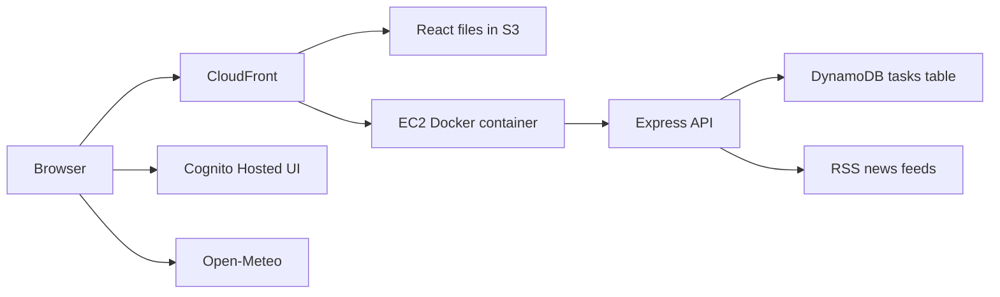

# Architecture

## Request flow

1. CloudFront serves the React application from S3.
2. Cognito signs the user in and returns tokens to the React application.
3. React sends the access token in the `Authorization` header.
4. CloudFront forwards `/api/v1/*` requests to EC2.
5. Express verifies the token and reads the Cognito user ID.
6. Tasks are stored under that user ID in DynamoDB.
7. Express loads world news from a short list of RSS feeds.

## AWS stacks

`personal-toolkit` contains only Cognito resources:

- User Pool
- Hosted UI domain
- SPA app client

`clouddesk-express` contains the application backend resources:

- EC2 instance and Elastic IP
- Docker image repository in ECR
- DynamoDB tasks table
- IAM roles and security group
- S3 deployment bucket
- CodeBuild project

The previous Lambda and API Gateway backend has been removed.
