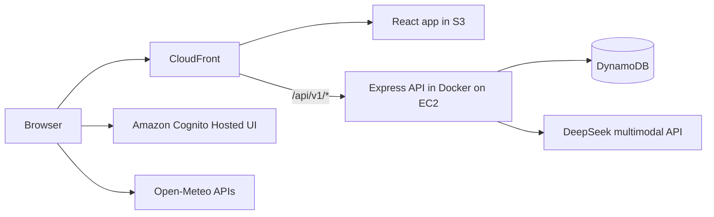

# SubLens

[](https://github.com/MingtanSun/personal-toolkit-aws/actions/workflows/ci.yml)

SubLens is an AI-assisted subscription tracker and personal dashboard built as a full-stack AWS portfolio project. Users can upload a subscription screenshot, review the details extracted by a multimodal model, save the corrected record, and manage subscriptions and tasks in a private account.

**Live demo:** [https://d1l863cphghqlg.cloudfront.net/](https://d1l863cphghqlg.cloudfront.net/)

## Highlights

- Upload and preview PNG, JPEG, or WebP subscription screenshots.
- Extract service, plan, billing cycle, amount, currency, first payment date, website, and notes with a multimodal DeepSeek model.
- Compare a new screenshot with the user's saved subscriptions and display a possible-duplicate warning.
- Review and edit AI-generated fields before saving them.
- Create, update, filter, star, prioritize, and delete personal tasks.
- View current conditions and a five-day forecast, with Ottawa as the default and city search powered by Open-Meteo.
- Sign in through Amazon Cognito using OAuth 2.0 Authorization Code with PKCE.
- Keep every user's subscriptions and tasks isolated by the verified Cognito `sub` claim.
- Deploy the React frontend through S3 and CloudFront and the Dockerized Express API on EC2.

## Architecture



The browser signs in with Cognito and sends an access token with protected API requests. Express verifies the JWT, reads the user's `sub`, and uses it to query that user's DynamoDB records. Subscription screenshots are sent to Express as `multipart/form-data`; the API keeps the provider key on the server and sends the image to the multimodal model for analysis.

See [ARCHITECTURE.md](./ARCHITECTURE.md) for the complete request and deployment flow.

## Technology stack

| Layer | Technologies |
| --- | --- |
| Frontend | React 19, Vite 7, JavaScript, CSS |
| Backend | Node.js, Express 5, TypeScript, Multer |
| Authentication | Amazon Cognito, OAuth 2.0 Authorization Code + PKCE, `aws-jwt-verify` |
| Data | Amazon DynamoDB, AWS SDK for JavaScript v3 |
| AI | DeepSeek multimodal API through the OpenAI-compatible SDK |
| Cloud | EC2, Docker, ECR, S3, CloudFront, CodeBuild, Systems Manager, IAM |
| Delivery | GitHub Actions, AWS SAM, CloudFormation |

## Repository structure

```text
frontend-react/       React and Vite frontend
backend-express/      Express and TypeScript API
infra/                Cognito SAM/CloudFormation template
infra-express/        EC2, ECR, DynamoDB, IAM, S3, and CodeBuild template
.github/workflows/    CI and manual deployment workflows
archive/              Retired implementation notes kept for reference
```

The current application uses the Express backend. The previous Lambda and API Gateway implementation has been removed from the active architecture.

## API routes

```text
GET    /health

GET    /api/v1/tasks
POST   /api/v1/tasks
PATCH  /api/v1/tasks/:taskId
DELETE /api/v1/tasks/:taskId

POST   /api/v1/subscription/analyze
POST   /api/v1/subscription/submit
GET    /api/v1/subscription
PUT    /api/v1/subscription
DELETE /api/v1/subscription
```

Every `/api/v1/*` route requires a valid Cognito access token in the `Authorization: Bearer <token>` header. `/health` is public.

## DynamoDB model

Both feature tables use a composite key. The verified Cognito user ID is part of the partition key:

```text
Tasks table
PK = USER#{cognitoSub}
SK = TASK#{taskId}

Subscriptions table
PK = USER#{cognitoSub}
SK = SUBS#{subscriptionId}
```

This lets the API query one user's data without accepting a user ID from the browser.

## Local development

Requirements:

- Node.js 22 or newer
- AWS credentials that can access the configured DynamoDB tables
- A Cognito user pool and SPA client
- A DeepSeek API key for screenshot analysis

Start the backend:

```bash
cd backend-express
cp .env.example .env
npm install
npm run dev
```

Fill `backend-express/.env` with your local configuration. Do not commit this file.

In another terminal, start the frontend:

```bash
cd frontend-react
npm install
npm run dev
```

The frontend runs at `http://localhost:8000` and calls the local API at `http://localhost:3000/api/v1`. Cognito's local callback and logout URLs must include `http://localhost:8000/`.

## Validation and deployment

Every push and pull request runs the GitHub Actions CI workflow, which installs dependencies, type-checks and builds the Express API, builds the React frontend, and validates the Cognito SAM template.

Deployment workflows are intentionally manual:

- **Deploy Cognito** updates the authentication stack.
- **Deploy Express Backend** builds a Docker image with CodeBuild, pushes it to ECR, and replaces the EC2 container through Systems Manager.
- **Deploy Frontend** builds the Vite app, syncs it to S3, and invalidates CloudFront.

Repository secrets are used for AWS credentials and `DEEPSEEK_API_KEY`; secrets are not stored in source control.

## Documentation

- [Application documentation](./APPLICATION_DOCUMENTATION.md)
- [Architecture](./ARCHITECTURE.md)
- [Technical project overview](./PROJECT_OVERVIEW.md)
- [Express API guide](./backend-express/README.md)
- [Backend infrastructure guide](./infra-express/README.md)

## Project status

SubLens is a working portfolio project with a deployed frontend, authenticated API, persistent user data, AI-assisted screenshot analysis, and repeatable cloud deployment. It is designed to demonstrate a complete full-stack workflow while keeping the Express code approachable and easy to study.
